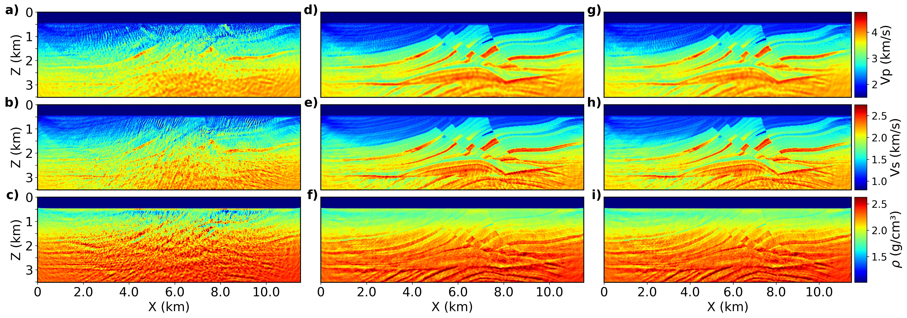
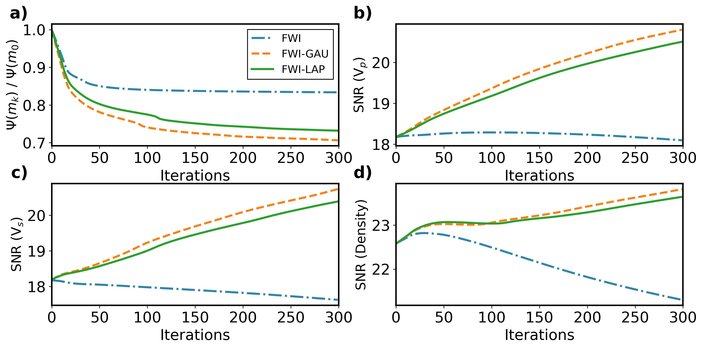

# Elastic Full-Waveform Inversion Based on Scale-Space Pyramid Frameworks

This repository contains PyTorch implementations and numerical experiments for robust elastic full-waveform inversion (FWI) using scale-space pyramid representations.

---

## Overview

| Method | Description |
|--------|-------------|
| `FWI` | Standard FWI with L2 loss |
| `FWI-GAU` | FWI with Gaussian pyramid loss |
| `FWI-LAP` | FWI with Laplacian pyramid loss |
| `FWI-GAU-ML` | FWI with Gaussian pyramid multilevel strategy |
| `FWI-LAP-ML` | FWI with Laplacian pyramid multilevel strategy |
| `FWI-MS` | FWI with multiscale strategy |

---
## Results



*Model reconstruction comparison across FWI, FWI-GAU, and FWI-LAP on Marmousi II.*



Convergence curves for FWI, FWI-GAU, and FWI-LAP. (a) Misfit function reduction. (b)–(d) SNR (in dB) of the reconstructed Vp, Vs, and density models, respectively.
---

---
## Folder Structure

```text
.
├── marmousi_model/            # Ground truth Marmousi II velocity model
├── Notebooks_ms_ml/           # Inverse crime: FWI-MS, FWI-GAU-ML, FWI-LAP-ML
├── Notebooks_loss/            # Inverse crime: FWI, FWI-GAU, FWI-LAP
├── Notebooks_loss_est_source/ # Non-inverse crime: simultaneous source & model
│                              #   inversion (FWI, FWI-GAU, FWI-LAP) on a
│                              #   subsampled model and dataset
├── sources/                   # True and estimated source wavelets
├── src_rec_positions/         # Source and receiver geometry
├── utils/                     # Shared utility functions
└── README.md
```
---
## Getting Started

### Prerequisites

- Python ≥ 3.8
- PyTorch ≥ 2.0.0 (with CUDA support recommended)
- Jupyter Notebook

```bash
pip install pyramid_loss # My implementation of pyramid functions
pip install deepwave
```

I thank the author of [Deepwave](https://github.com/ar4/deepwave) for providing
an excellent open-source seismic wave simulator that this work builds upon.

---
### Running Experiments

**Notebook-based experiments:**

```bash
cd Notebooks_ms_ml
jupyter notebook 00_gen_data.ipynb   # Generate data first
```

Then open any notebook under `Notebooks_loss/`, `Notebooks_ms_ml/`, or `Notebooks_loss_est_source/` and run cells sequentially. 

**Script-based experiments:**

```bash
cd scripts
bash run.sh
```

---

## Environment

All experiments were conducted on:

- **OS:** Ubuntu
- **GPU:** 1 × vGPU (48 GB VRAM)
- **Framework:** PyTorch

---

## Contact

If you have any questions, feel free to reach out: faxuanwu@126.com
